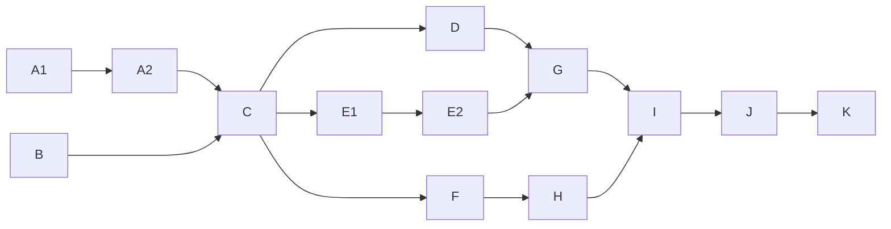

# Data Hamal

## 介绍

数据的搬运工, 一个 `ETL` 工具.

近期的工作, 也是在为公司, 开发商业的ETL工具. 

设立这个项目的初衷, 是实践一些工作中, 没能实现的些想法. 

就当是, 平行时空里的另一个自己, 做了另外的选择吧.

## 软件架构

软件架构说明

## 系统模块


~~~
com.striveonger.study
├── data-hamal-web                               // 前端框架 [-]
├── data-hamal-gateway                           // 网关模块 [8080]
├── data-hamal-apis                              // 全局接口 [-]
├── data-hamal-auth                              // 认证中心 [9000]
├── data-hamal-commons                           // 通用模块
│   └── data-hamal-common-core                   // 核心功能
│   └── data-hamal-common-web-core               // 核心功能
│   └── data-hamal-common-redis                  // 内存存储
│   └── data-hamal-common-mybatis                // 数据访问
│   └── data-hamal-common-logs                   // 日志工具
│   └── data-hamal-common-email                  // 邮件发送
│   └── data-hamal-common-remote                 // 远程调用
│   └── data-hamal-common-rabbit                 // 消息队列
│   └── data-hamal-common-swagger                // 接口文档
├── data-hamal-services                          // 开放服务
│   └── data-hamal-service-task                  // 任务模块
│       └── data-hamal-service-task-core         // 任务核心
│       └── data-hamal-service-task-common       // 公共内容
│       └── data-hamal-service-task-executor     // 任务执行
│       └── data-hamal-service-task-plugins      // 任务插件
│       └── data-hamal-service-task-worker       // 任务服务 [9010]
│   └── data-hamal-service-filestorage           // 文件服务 [9020]
├── data-hamal-providers                         // 基础服务
│   └── data-hamal-provider-leaf                 // 叶子服务 [9100]
├── pom.xml                                      // 公共依赖
~~~

>   服务碎片化

## 组件说明

### data-hamal-web

### data-hamal-gateway


### data-hamal-auth
> 认证中心, 目前集成了用户服务, 后面有必要的话再抽出去


### data-hamal-service-task
>   每个任务, 只允许有一个线程池.
>   线程池: 最多支持4个core

### data-hamal-service-filestorage
>   提供文件的上传与下载功能
>   流媒体格式的文件是支持预览的哦~

### data-hamal-provider-leaf
> 照搬了美团开源的Leaf, 提供分布式的ID服务

## 安装教程

### 关于ProtoBuf

```shell
protoc --java_out=./ MessageBody.proto 
```
> 根据ProtoBuf文件, 编译输出java的类文件

### Docker 启动

```shell
# Build 
mvn clean install -DskipTests -P docker

# 启动服务
docker compose -p data-hamal up -d --no-deps --build

# 查看服务
docker compose -p data-hamal ps

# 重启服务
docker compose -p data-hamal restart

# 停止服务
docker compose -p data-hamal down

# 查看镜像
docker compose -p data-hamal images
```

## 使用说明


## DAG测试

### 图例

> Task Executor 测试用例示意图

### 扩展节点
```
    X1 --> X2
    X2 --> X3
    X3 --> F
    
    K  --> L1
    K  --> M1
    K  --> N1
    L1  --> L2
    L2  --> L3
    L3  --> L4
    M1  --> M2
    M2  --> M3
    M3  --> M4
    N1  --> N2
    N2  --> N3
    N3  --> N4
```